The Markdown Curator is a "Java 25+ library/application framework for monitoring repositories of Markdown documents, running queries on them, and inserting the output back into the documents."

The simplest explanation:

- You write queries directly in your (Markdown) content.
- Queries are defined in YAML-embedded-in-HTML-comments. That makes the query definitions disappear when the Markdown is previewed or exported.
- The Markdown Curator detects changes to the content, runs all queries, and updates the query output accordingly.

Here's a an example: a query that outputs a sorted list of all notes in the folder of this note, **Systems**:
<!--query:list-->
- [[Logseq]]
- [[Markdown Curator]]
- [[Markdown Curator Demo]]
- [[Obsidian]]
<!--/query (73097d60)-->

The result is what I call "dynamic content in static Markdown documents, without lock-in". What I mean by that:

- **dynamic**: because the Markdown Curator runs in the background, monitors files and updates them automatically. It does that so fast that it seems instant.
- **static**: the output of queries is embedded in the Markdown files themselves, like all other content. 
- **without lock-in**: the queries and their output are plaintext, and do not depend on a special editor and/or plug-in. In case you decide to stop using the Markdown Curator, you only need to remove the query tags from the content.

The [[Markdown Curator Demo]] - that includes this file - shows some of what the tool can do.

See [voostindie/markdown-curator](https://github.com/voostindie/markdown-curator) for more information.

## Processors

The curator is an event-based, pluggable system. Every change triggers an event that is pushed through a pipeline of processors. The processors are provided by independent modules.

A change is of a kind — create, update or delete — and has a payload, for example a Markdown document, 

Every processor declares which payloads it consumes and which payloads it produces. 

At application startup, the system orders the available processors consistently so that processors that produce a certain payload come before all processors that depend on that payload. For this vault that order is the following:

```mermaid
graph TB
    VaultReloader ==> VaultInitializer
    VaultReloader@{ shape: subproc }
    VaultInitializer ==> DailyProducer
    VaultInitializer@{ shape: subproc }
    DailyProducer ==> DailyRepository
    DailyProducer@{ shape: subproc }
    DailyRepository ==> FrontMatterRepository
    DailyRepository@{ shape: subproc }
    FrontMatterRepository ==> MarkerProducer
    FrontMatterRepository@{ shape: subproc }
    MarkerProducer ==> ProjectLeadMarkerProducer
    MarkerProducer@{ shape: subproc }
    ProjectLeadMarkerProducer ==> ProjectLeadMarkerRepository
    ProjectLeadMarkerProducer@{ shape: subproc }
    ProjectLeadMarkerRepository ==> ProjectProducer
    ProjectLeadMarkerRepository@{ shape: subproc }
    ProjectProducer ==> ProjectStatusMarkerProducer
    ProjectProducer@{ shape: subproc }
    ProjectStatusMarkerProducer ==> ProjectStatusMarkerRepository
    ProjectStatusMarkerProducer@{ shape: subproc }
    ProjectStatusMarkerRepository ==> WeeklyProducer
    ProjectStatusMarkerRepository@{ shape: subproc }
    WeeklyProducer ==> MarkerRepository
    WeeklyProducer@{ shape: subproc }
    MarkerRepository ==> ProjectRepository
    MarkerRepository@{ shape: subproc }
    ProjectRepository ==> WeeklyRepository
    ProjectRepository@{ shape: subproc }
    WeeklyRepository ==> FrontMatterProjectAttributeValueProducer
    WeeklyRepository@{ shape: subproc }
    FrontMatterProjectAttributeValueProducer ==> ProjectLastModifiedAttributeValueProducer
    FrontMatterProjectAttributeValueProducer@{ shape: subproc }
    ProjectLastModifiedAttributeValueProducer ==> ProjectLeadAttributeValueProducer
    ProjectLastModifiedAttributeValueProducer@{ shape: subproc }
    ProjectLeadAttributeValueProducer ==> ProjectStatusAttributeValueProducer
    ProjectLeadAttributeValueProducer@{ shape: subproc }
    ProjectStatusAttributeValueProducer ==> ProjectAttributeRepository
    ProjectStatusAttributeValueProducer@{ shape: subproc }
    ProjectAttributeRepository ==> ProjectAttributeValueFrontMatterWriter
    ProjectAttributeRepository@{ shape: subproc }
```

<!--query:processorGraph orientation: tb -->

<!--/query (71330a2f)-->
## Producers and Consumers

The following diagram shows processors combined with the payloads that processor consume and produce. The resulting diagram is a directed graph that has no cycles except for one: the `VaultReloader` is a special case that is automatically inserted at the front of the list. (I will explain that some other time.)

```mermaid
graph LR
    VaultReloader --> Reset
    Document --> VaultReloader
    VaultReloader@{ shape: subproc }
    VaultInitializer --> Document
    VaultInitializer --> Folder
    Reset --> VaultInitializer
    VaultInitializer@{ shape: subproc }
    DailyProducer --> Daily
    Document --> DailyProducer
    DailyProducer@{ shape: subproc }
    Daily --> DailyRepository
    DailyRepository@{ shape: subproc }
    Document --> FrontMatterRepository
    FrontMatterRepository@{ shape: subproc }
    MarkerProducer --> Marker
    Document --> MarkerProducer
    MarkerProducer@{ shape: subproc }
    ProjectLeadMarkerProducer --> ProjectLeadMarker
    Marker --> ProjectLeadMarkerProducer
    ProjectLeadMarkerProducer@{ shape: subproc }
    ProjectLeadMarker --> ProjectLeadMarkerRepository
    ProjectLeadMarkerRepository@{ shape: subproc }
    ProjectProducer --> Project
    Document --> ProjectProducer
    ProjectProducer@{ shape: subproc }
    ProjectStatusMarkerProducer --> ProjectStatusMarker
    Marker --> ProjectStatusMarkerProducer
    ProjectStatusMarkerProducer@{ shape: subproc }
    ProjectStatusMarker --> ProjectStatusMarkerRepository
    ProjectStatusMarkerRepository@{ shape: subproc }
    WeeklyProducer --> Weekly
    Document --> WeeklyProducer
    WeeklyProducer@{ shape: subproc }
    Marker --> MarkerRepository
    MarkerRepository@{ shape: subproc }
    Project --> ProjectRepository
    ProjectRepository@{ shape: subproc }
    Weekly --> WeeklyRepository
    WeeklyRepository@{ shape: subproc }
    FrontMatterProjectAttributeValueProducer --> ProjectAttributeValue
    Project --> FrontMatterProjectAttributeValueProducer
    FrontMatterProjectAttributeValueProducer@{ shape: subproc }
    ProjectLastModifiedAttributeValueProducer --> ProjectAttributeValue
    Project --> ProjectLastModifiedAttributeValueProducer
    Daily --> ProjectLastModifiedAttributeValueProducer
    ProjectLastModifiedAttributeValueProducer@{ shape: subproc }
    ProjectLeadAttributeValueProducer --> ProjectAttributeValue
    Daily --> ProjectLeadAttributeValueProducer
    Project --> ProjectLeadAttributeValueProducer
    ProjectLeadMarker --> ProjectLeadAttributeValueProducer
    ProjectLeadAttributeValueProducer@{ shape: subproc }
    ProjectStatusAttributeValueProducer --> ProjectAttributeValue
    ProjectStatusMarker --> ProjectStatusAttributeValueProducer
    Daily --> ProjectStatusAttributeValueProducer
    Project --> ProjectStatusAttributeValueProducer
    ProjectStatusAttributeValueProducer@{ shape: subproc }
    ProjectAttributeRepository --> ProjectAttributeRepositoryUpdate
    Project --> ProjectAttributeRepository
    ProjectAttributeValue --> ProjectAttributeRepository
    ProjectAttributeRepository@{ shape: subproc }
    ProjectAttributeRepositoryUpdate --> ProjectAttributeValueFrontMatterWriter
    ProjectAttributeValue --> ProjectAttributeValueFrontMatterWriter
    ProjectAttributeValueFrontMatterWriter@{ shape: subproc }
```

<!--query:processorGraph edges: [produce, consume] -->

<!--/query (682f4620)-->
